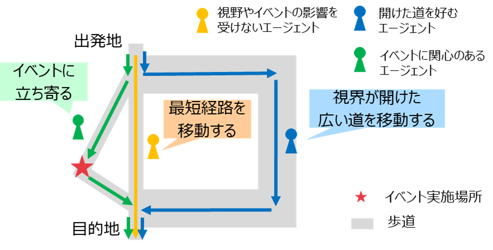

# FY2022 Project PLATEAU UC22-023「歩行者移動・回遊行動シミュレーション」の成果物（歩行シミュレーションモデル）

## 1. 概要
歩行者の回遊行動を視野やイベント開催を変数としてシミュレーションするスクリプトです。

## 2．「歩行者移動・回遊行動シミュレーション」について
令和4年度の3D都市モデルを活用した⺠間サービス創出型ユースケース開発業務「歩行者移動・回遊行動シミュレーション」では、東京都西新宿エリアを対象として、エリアマネジメントを効果的なものとするため、3D都市モデルを活用した歩行者行動シミュレーションを開発しました。
本リポジトリにあるmodel.jsonは、[artisoc Cloud](https://mas.kke.co.jp/artisoccloud/)において実行可能な、歩行者の回遊行動をシミュレーションするスクリプトです。

歩行シミュレーションの概要は次のとおりです。
### 対象地区
東京都新宿区　西新宿地区
### シミュレーション実施目的
- 対象地区における平常時（平日/休日）の人流の再現
- 対象地区においてイベント（2022年11月に実施された社会実験イベント「FUN MORE TIME SHINJUKU」を想定）が実施された際（平日/休日）の人流の変化の把握
	- イベント時の人流の変化の表現にあたっては、イベントの有無・イベントを宣伝する広告の有無を反映します。

### 歩行シミュレーションアルゴリズム
- 通常のダイクストラ法に基づく最短経路選択モデルに対して、エージェントの移動動速度、視界情報、アトラクタ強さ、イベントへの立ち寄り比率、階移動負荷をパラメータとして加えた経路選択モデルを作成しました。
- エージェントは各パラメータに対する感度パラメータを与えられ、出発地から目的地までの経路を選択します。
- 例えば、上空が開けている空間を好む歩行者や、オープンカフェ等のイベント（アトラクタ）を好む歩行者は、経路選択においてこれらの要素を考慮した立ち寄りや遠回りを行います。
- 併せて、イベントを宣伝するような広告の設置を想定し、広告を見た歩行者がイベントへの興味を増し、イベント実施場所に近づくような経路変更を行うモデルを作成しました。
- アルゴリズムの詳細は [「歩行者移動・回遊行動シミュレーション 技術検証レポート」](https://www.mlit.go.jp/plateau/libraries/technical-reports/)を参照してください。

## 3．利用手順
利用手順として、インストール方法、インストール後の使い方、動作環境、前提ソフトウェアを記載します。
詳細は、[こちら](https://project-plateau.github.io/UC22-023-Pedestrian-Simulation-Model-for-artisocCloud/)をご覧ください。

なお、このモデルは、artisoc Cloudのstandardライセンスで開発可能なモデルであり、同ライセンスでの使用を前提としています。

## ライセンス <!-- 定型文のため変更しない -->
* ソースコードおよび関連ドキュメントの著作権は国土交通省に帰属します。
* 本ドキュメントは[Project PLATEAUのサイトポリシー](https://www.mlit.go.jp/plateau/site-policy/)（CCBY4.0および政府標準利用規約2.0）に従い提供されています。

## 注意事項 <!-- 定型文のため変更しない -->

* 本レポジトリは参考資料として提供しているものです。動作保証は行っておりません。
* 予告なく変更・削除する可能性があります。
* 本レポジトリの利用により生じた損失及び損害等について、国土交通省はいかなる責任も負わないものとします。

## 参考資料　 <!-- 各リンクは納品時に更新 -->
* 歩行者移動・回遊行動シミュレーション技術検証レポート: https://www.mlit.go.jp/plateau/libraries/technical-reports/
*  PLATEAU Webサイト Use caseページ「歩行者移動・回遊行動シミュレーション」: https://www.mlit.go.jp/plateau/use-case/
*  artisoc Cloud：https://mas.kke.co.jp/artisoccloud/
